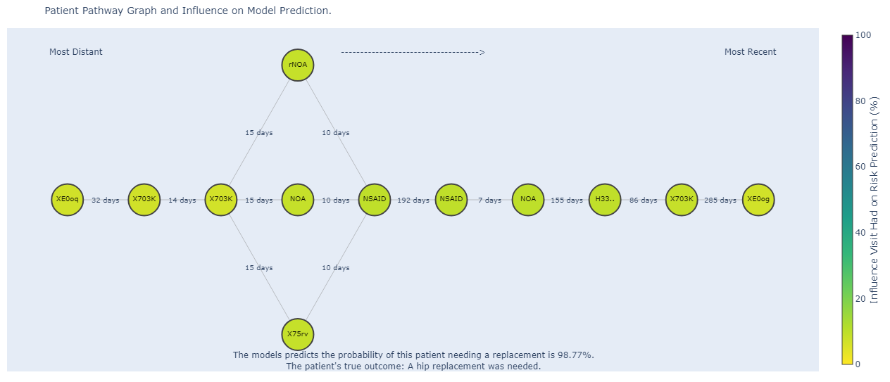
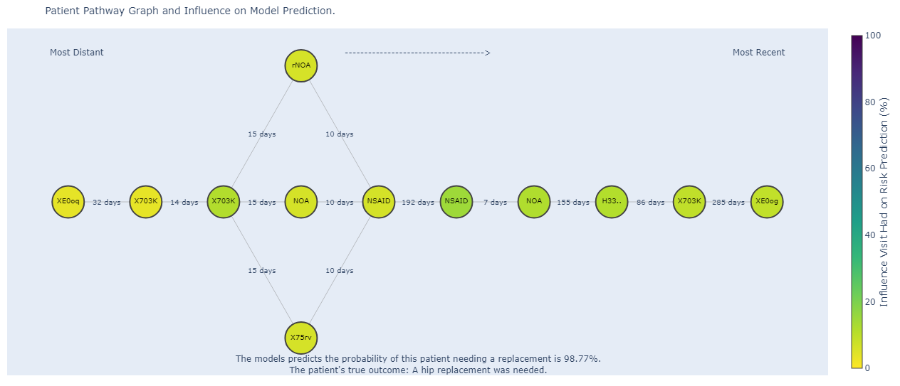
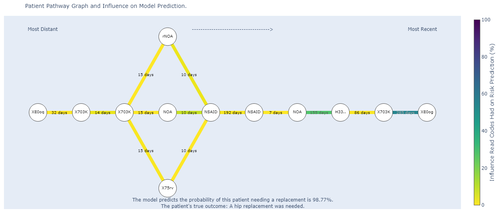

# Explainable TG-CNN
Visual explainability for TG-CNN model for hip replacement risk prediction including Grad-CAM and activation mapping.


<!-- First train the model in `TGCNN_gradcam.ipynb` and then load your saved weights `hip_1999_to_one_year_advance_model1_CNN_layer` into the `grad_cam_graph_run.ipynb`. -->


## ABOUT


This code produces explainable graphs using the 3D CNN layers from the [TG-CNN model](https://dl.acm.org/doi/10.1007/978-3-031-16564-1_34) trained to predict hip replacement risk 5 years in advance. These graphs show which edges or timesteps are the most influential to model prediction.

In this repository we provide 4 main methodologies (with summary statistic variations):

* original-Grad-CAM for TGCNN Graphs
* abs-Grad-CAM for TGCNN Graphs
* fmap-activation for TGCNN Graphs
* edge-activation for TGCNN Graphs

In the sections below you can find GIFs explaining how these explainable graph visualisations are produced.

> [!IMPORTANT]
> _Please note that the data generated in this repository are fictitious and randomly produced, it does not contain any real patient data._  

### Finding the Filter with The Largest Activation Difference Between Classes

The GIF below shows how to find the filter with the largest activation difference between the classes over the whole patient cohort:


### Grad-CAM

The GIF below shows how the gradients of the TGCNN models predicted output in respect to the output of the 3D CNN layer are used to show timestep/visit activation per input graph:


1. Extract the gradients of the output of the 3D CNN layer in respect to the output of the TG-CNN model.
2. Calculate the weight of each filter.
3. Calculate the localisation map (for heatmap colouring) by either getting the ReLU or the absolute value of the sum of the weighted feature maps.
4. Map the localisation maps to the timesteps and get an average of the weights for each sliding window recurrence on each timestep.
5. Get the weights as a percentage of all the weights, to see the percentage influence of each timestep/visit. 
6. Colour the stacked nodes (representing the Read Codes recorded during a visit) depending on the percentage influence.

original-Grad-CAM with ReLU:


abs-Grad-CAM with absolute value instead of ReLU:


### Activation mapping graphs for timestep

The GIF below shows how the feature maps from the 3D CNN layer are used to show timestep/visit activation per input graph:


1. Extract the feature maps from the 3D CNN layer of the TG-CNN model.
2. Find the feature maps with the strongest differentiation of maximum activation between the positive and negative class.
3. Select the feature map with the largest activation difference (or mean or median of all feature maps) to show timestep/visit activation.
4. Map the feature map weights to the timesteps and get an average of the weights for each sliding window recurrence on each timestep.
5. Get the weights as a percentage of all the weights, to see the percentage influence of each timestep/visit. 
6. Colour the stacked nodes (representing the Read Codes recorded during a visit) depending on the percentage influence.



### Activation mapping graphs for edges

The GIF below shows how the filters from the 3D CNN layer are used to show edge activation per input graph:


1. Extract the filters from the 3D CNN layer of the TG-CNN model.
2. Find the filter with the strongest differentiation of maximum activation between the positive and negative class.
3. Select the filter with the largest activation difference (or mean or median of all filters) to show edge activation.
4. Do element-wise multiplication between the filter and the input graph as a sliding window.
5. Take the mean of for each element the sliding window passes over, to get the edge activation tensor.
6. Use the edge activation tensor to get weights for the edges.
7. Get the weights as a percentage of all the weights, to see the percentage influence of each pair of Read Codes. 
8. Colour the edges depending on the percentage influence.



To see the interactive Plotly version of these graphs visit [this webpage](https://zoehancox.github.io/graph-survey/pat2.html).


---


## PROJECT STRUCTURE

The main code is found in the `src` folder of the repository. See Usage below for more information.

```
|-- documentation                      # Images and other background files
|-- src
|-- early_stopping_cv.py               # Code to stop the model early if it starts overfitting
|-- edge_activations.ipynb             # Notebook to run edge-activation code
|-- fake_read_code_descriptions        # Fake Read Codes and descriptions for node labelling
|-- grad_cam_graph_run.ipynb           # Notebook to run Grad-CAM code
|-- LICENSE.txt
|-- README.md
|-- requirements.txt                   # Which packages are required to run this code 
|-- timestep_activations.ipynb         # Notebook to run fmap-activation code
|__ train_model_with_fake_pats.ipynb   # Code to train TGCNN model on fake data
```

### BUILT WITH
[](https://www.python.org/downloads/release/python-380/)
- [NumPy](https://numpy.org/)
- [NetworkX](https://networkx.org/)

## INSTALLATION


### To clone the repo:

To clone this repository:
- Open Git Bash, your Command Prompt or Powershell
- Navigate to the directory where you want to clone this repository: `cd/path/to/directory`
- Run git clone command:
`git clone https://github.com/ZoeHancox/explainable_tgcnn`

To create a suitable environment we suggest using Anaconda:
- Build conda environment: `conda create --name graph_viz python=3.8`
- Activate environment: `conda activate graph_viz`
- Install requirements: `python -m pip install -r ./requirements.txt`

---


## USAGE

To train the model on fake (randomly generated data) and get model weights run the code in `train_model_with_fake_pats.ipynb`.

To get the plotly visualisation graphs:
* See examples in `grad_cam_graph_run.ipynb` to run the Grad-CAM code.
* See examples in `timestep_activations.ipynb` to run the feature map/timestep activation code.
* See examples in `edge_activations.ipynb` to run the edge activation code.


<!-- ## ROADMAP

Features to come:

- [ ] Show edge activation using NetworkX Plotly
- [ ] Add a list of your own node names rather than using ints
- [ ] Rules so that only fully connected graphs can be input
- [ ] Show time step activation using NetworkX -->

## SUPPORT

See the [Issues](https://github.com/ZoeHancox/explainable_tgcnn/issues) in GitHub for a list of proposed features and known issues. Contact [Zoe Hancox](mailto:Z.L.Hancox@Leeds.ac.uk) for further support. 


<!-- ## TESTING

Run tests by using `pytest test_graphs/test_calculations.py` in the top directory. -->

## LICENSE

Unless stated otherwise, the codebase is released under the BSD Licence. This covers both the codebase and any sample code in the documentation.

See [LICENCE](https://github.com/ZoeHancox/explainable_tgcnn/blob/main/LICENSE.txt) for more information.

## ACKNOWLEDGEMENTS

The TG-CNN model was developed using data provided by patients and collected by the NHS as part of their care and support. 