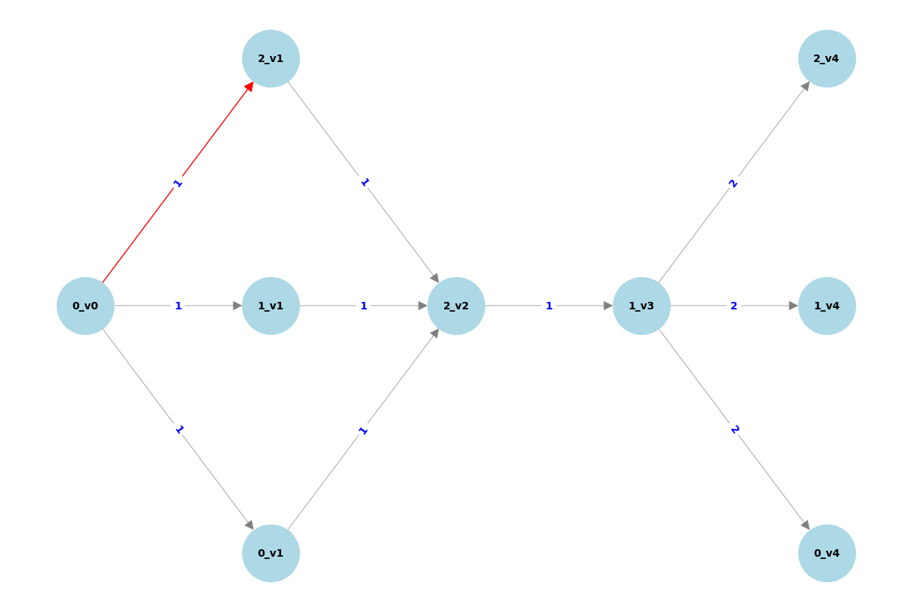

# Explainable TG-CNN
Visual explainability for TG-CNN model including Grad-CAM ideas and activation mapping.


<!-- First train the model in `TGCNN_gradcam.ipynb` and then load your saved weights `hip_1999_to_one_year_advance_model1_CNN_layer` into the `grad_cam_graph_run.ipynb`. -->


## ABOUT


Produce explainable graphs using the 3D CNN layers from the trained [TG-CNN model](https://dl.acm.org/doi/10.1007/978-3-031-16564-1_34). These graphs show which edges or timesteps are the most important during model prediction.

> [!IMPORTANT]
> _Please note that the examples provided in this repository are fictitious and do not contain any real patient data._  


### Activation mapping graphs for edges steps:

The GIF below shows how the filters from the 3D CNN layer are used to show edge activation per input graph:


1. Extract the filters from the 3D CNN layer of the TG-CNN model.
2. Find the filter with the strongest differentiation of maximum activation between the positive and negative class amongst all the input graphs.
3. Select the filter with the largest activation difference to show edge activation.
4. Make the stride length the same as the number of timesteps in the filter.
5. Do element-wise multiplication between the filter and the input graph, to get the edge activation tensor.
6. Use the edge activation tensor to get weights for the edges. Edges with zero activation are grey, edges with activation are red. The higher the edge activation weight the thicker the edge.
7. Observe which edges affect the prediction outcome. Nodes are named as e.g. 5_t1 (Read Code = 5, timestep = 1).




---
#### Equations

To get the edge weights: For a given filter $f_{k}$, patient $p$, and time step $i$, the process can be summarised as:

1. Extract the slice:

   $W_{i}^{(p, k)}$ = $G_{p}[i:i+F, :, :]$,
   
   
   where $F$ is the size of the filter in the time dimension, $G_{p}$ as the input tensor for patient $p$, $f_{k}$ as the $k$-th filter, and $W_{i}^{(p, k)}$ is the slice of the tensor $G_{p}$ at time step $i$ with the same dimensions as the filter $f_{k}$.

2. Apply the filter and sum the result:
   
   $S_{i}^{(p, k)}$ = $\sum (W_{i}^{(p, k)} \odot f_{k}),$

   where $\odot$ denotes element-wise multiplication.

3. Apply the leaky ReLU activation function:
   
   $A_{i}^{(p, k)}$ = $leaky ReLU(S_{i}^{(p, k)}, \alpha),$

    where $\alpha$ is the leaky ReLU parameter.

4. Compute the maximum activation value ($M$) across all time steps:
   
   $M_{(p, k)}$ = $\max_{i} (A_{i}^{(p, k)})$

5. Combine these into one formula:

    $M_{(p, k)}$ = $\max_{i} \left( leaky ReLU \left( \sum (G_{p}[i:i+F, :, :] \odot f_{k}), \alpha \right) \right)$


---

### Graph-Grad-CAM

_TODO: Graph-Grad-CAM explanation to go here with gif and equations_


## PROJECT STRUCTURE

The main code is found in the `src` folder of the repository. See Usage below for more information.

```
|-- documentation             # Images and other background files
|--
|-- LICENSE.txt
|-- README.md
|__ requirements.txt          # Which packages are required to run this code
```

### BUILT WITH
[](https://www.python.org/downloads/release/python-380/)
- [NumPy](https://numpy.org/)
- [NetworkX](https://networkx.org/)

## INSTALLATION


### To clone the repo:

To clone this repository:
- Open Git Bash, your Command Prompt or Powershell
- Navigate to the directory where you want to clone this repository: `cd/path/to/directory`
- Run git clone command:
`git clone https://github.com/ZoeHancox/explainable_tgcnn`

To create a suitable environment we suggest using Anaconda:
- Build conda environment: `conda create --name graph_viz python=3.8`
- Activate environment: `conda activate graph_viz`
- Install requirements: `python -m pip install -r ./requirements.txt`

---


## USAGE

See examples in `grad_cam_graph_run.ipynb` for how to use this code.


<!-- ## ROADMAP

Features to come:

- [ ] Show edge activation using NetworkX Plotly
- [ ] Add a list of your own node names rather than using ints
- [ ] Rules so that only fully connected graphs can be input
- [ ] Show time step activation using NetworkX -->

## SUPPORT

See the [Issues](https://github.com/ZoeHancox/explaiable_tgcnn/issues) in GitHub for a list of proposed features and known issues. Contact [Zoe Hancox](mailto:Z.L.Hancox@Leeds.ac.uk) for further support. 


<!-- ## TESTING

Run tests by using `pytest test_graphs/test_calculations.py` in the top directory. -->

## LICENSE

Unless stated otherwise, the codebase is released under the BSD Licence. This covers both the codebase and any sample code in the documentation.

See [LICENCE](https://github.com/ZoeHancox/explainable_tgcnn/blob/main/LICENSE.txt) for more information.

## ACKNOWLEDGEMENTS

The TG-CNN model was developed using data provided by patients and collected by the NHS as part of their care and support. 